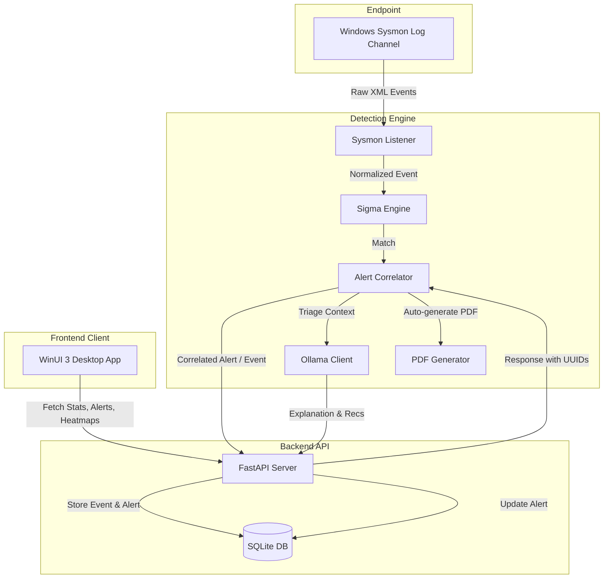

# SOC-EDR System Context

This document serves as a comprehensive technical context guide for developers and AI assistants working on the SOC-EDR (Security Operations Center - Endpoint Detection and Response) platform.

---

## 📖 Overview

The SOC-EDR System is a security monitoring and incident response platform designed to collect endpoint events (via Windows Sysmon), detect suspicious activities (using Sigma Rules & MITRE ATT&CK Mapping), automate alert triage with AI, and assist security analysts during incident investigations.

---

## 🏛️ System Architecture

The platform is split into three main modules:



1. **Backend API (FastAPI + SQLite)**:
   - Exposes RESTful APIs for event collection, alert management, and dashboard statistics.
   - Manages SQLite database relations and cascades.
2. **Detection Engine (Python)**:
   - Listens to Windows Sysmon events in real-time.
   - Normalizes XML events and matches them against loaded Sigma rules.
   - Groups matching alerts into incidents using an active temporal correlator (5-minute window).
   - enriches alerts with MITRE ATT&CK techniques.
   - Leverages a local Ollama LLM (`phi4-mini`) to triage, explain, and provide investigation recommendations.
   - Auto-generates incident reports (PDF) via ReportLab when incidents accumulate alerts.
3. **Frontend Dashboard (WinUI 3 / C#)**:
   - Desktop application showing dashboard statistics, alert queues, MITRE techniques, reports, and investigations.

---

## 📁 Repository Structure

```text
SOC-EDR-SYSTEM/
├── backend/                  # FastAPI Application
│   ├── api/                  # API routers (events, alerts, stats, reports)
│   ├── database/             # SQLite connection (db.py) and Schema (schema.sql)
│   ├── models/               # Pydantic schemas (planned or active)
│   ├── services/             # Core business logic (alert, event, report services)
│   ├── requirements.txt      # Python dependencies for backend
│   └── main.py               # Backend entry point
├── detection/                # Threat Detection Engine
│   ├── ai/                   # AI Triage & prompts
│   ├── ai_triage/            # Ollama Client & prompts
│   ├── mitre/                # MITRE technique loaders and mappers
│   ├── reports/              # PDF generator engines
│   ├── sigma/                # Rules loader and engine matcher
│   ├── sysmon/               # Sysmon event listener (win32evtlog) and normalizers
│   ├── requirements.txt      # Python dependencies for detection
│   ├── config.py             # Engine configurations (Ollama model, backend endpoint)
│   └── main.py               # Detection Engine entry point
├── frontend/                 # WinUI 3 Desktop Application
│   └── EDRDashboard/         # Visual Studio Solution
│       ├── Views/            # Pages (Dashboard, Alerts, Incidents, MITRE, Reports, Investigations, Settings)
│       ├── Models/           # Client-side data models
│       ├── ViewModels/       # MVVM view models
│       ├── Services/         # API HTTP communication services
│       └── EDRDashboard.csproj
├── sigma-rules/              # Rule repositories
│   ├── custom/               # Hand-crafted Sigma rules (encoded powershell, lsass dump, etc.)
│   └── stable/               # Stable standard Sigma rules
├── scripts/                  # Management & Setup Scripts
└── docs/                     # Technical documents (empty/planned)
```

---

## 🗄️ Database Schema (SQLite)

Tables defined in [schema.sql](file:///c:/Users/user/Desktop/internship26/SOC-EDR-SYSTEM/backend/database/schema.sql):

- **`mitre_techniques`**:
  - `technique_id` (TEXT, PK) - e.g., `T1059.001`
  - `name` (TEXT)
  - `tactic` (TEXT)
  - `description` (TEXT)
- **`events`**:
  - `id` (TEXT, PK) - UUID generated by the backend
  - `event_id` (INTEGER) - Sysmon Event ID (e.g. 1 for Process Creation, 10 for Process Access)
  - `host` (TEXT) - Hostname of the target endpoint
  - `process_name` (TEXT)
  - `parent_process` (TEXT)
  - `command_line` (TEXT)
  - `raw_json` (TEXT)
  - `created_at` (TEXT) - Defaults to ISO8601 UTC time
- **`alerts`**:
  - `id` (TEXT, PK) - UUID generated by the backend
  - `rule_name` (TEXT)
  - `severity` (TEXT) - Default `Medium` (High, Critical, Medium, Low)
  - `status` (TEXT) - Default `New` (`New`, `Investigating`, `Escalated`, `Closed`, `False Positive`)
  - `technique_id` (TEXT)
  - `event_id` (TEXT, FK references `events(id)` **ON DELETE CASCADE**)
  - `incident_id` (TEXT) - Grouping identifier for temporal correlation
  - `ai_explanation` (TEXT) - Explanation generated by Ollama
  - `ai_recommendations` (TEXT) - Mitigation advice from Ollama
  - `created_at` (TEXT)
  - `updated_at` (TEXT)
- **`investigations`**:
  - `id` (TEXT, PK)
  - `alert_id` (TEXT, FK references `alerts(id)`)
  - `analyst_notes` (TEXT)
  - `created_at` (TEXT)
  - `updated_at` (TEXT)

---

## ⚡ API Endpoints Summary

Refer to [API_DOCUMENTATION.md](file:///c:/Users/user/Desktop/internship26/SOC-EDR-SYSTEM/backend/API_DOCUMENTATION.md) for full payloads.

| Method | Endpoint | Description |
| :--- | :--- | :--- |
| **POST** | `/events/` | Create a normalized event (returns `event_id`) |
| **GET** | `/events/` | List all events (ordered by creation date desc) |
| **GET** | `/events/{event_id}` | Retrieve details of a specific event |
| **DELETE** | `/events/{event_id}` | Delete an event (cascades delete to associated alerts) |
| **POST** | `/alerts/` | Create an alert (returns `alert_id`) |
| **GET** | `/alerts/` | List all alerts (optional filters: `status`, `severity`) |
| **GET** | `/alerts/{alert_id}` | Retrieve details of a specific alert |
| **PATCH** | `/alerts/{alert_id}/status` | Update alert triage workflow status |
| **PATCH** | `/alerts/{alert_id}/ai` | Add/Update AI explanation and recommendations |
| **DELETE** | `/alerts/{alert_id}` | Delete a specific alert |
| **GET** | `/stats/summary` | Dashboard counts (`total_alerts`, `critical_alerts`, `open_alerts`) |
| **GET** | `/stats/trends` | Daily alert aggregation counts |
| **GET** | `/stats/heatmap` | MITRE ATT&CK technique count mapping |
| **GET** | `/reports/alert/{alert_id}` | Retrieve generated PDF report bytes |

---

## 🤖 AI Triage & Explanation Pipeline

- **LLM Engine**: Ollama running local model `phi4-mini`.
- **API Endpoint**: `http://127.0.0.1:11434/api/generate` (timeout: 180s).
- **Prompt**: Located in [ai_triage/prompt_templates.py](file:///c:/Users/user/Desktop/internship26/SOC-EDR-SYSTEM/detection/ai_triage/prompt_templates.py).
- **Output Format**:
  - Must return structured blocks labeled `EXPLANATION:` and `RECOMMENDATIONS:`.
  - The client parses these keywords and splits the response to populate `ai_explanation` and `ai_recommendations` in the database.

---

## 🛠️ Setup & Execution Guide

### 1. Prerequisites
- Windows OS (required for Sysmon Event Log listening)
- Sysmon installed and running (with standard config)
- Python 3.10+
- VS / MSBuild (for WinUI 3 Frontend compiling)
- Ollama installed (with `phi4-mini` model pulled)

### 2. Backend Setup
```bash
# Navigate to backend
cd backend

# Create Virtual Environment & Activate
python -m venv venv
venv\Scripts\activate

# Install Dependencies
pip install -r requirements.txt

# Start Backend Server (runs on Port 8000 & initializes DB tables automatically)
uvicorn main:app --reload
```

### 3. Detection Engine Setup
```bash
# Navigate to detection
cd ../detection

# Activate environment (or use backend venv)
..\backend\venv\Scripts\activate

# Install Dependencies (pywin32, pysigma, httpx, reportlab, pyyaml)
pip install -r requirements.txt

# Ensure Ollama is running and model is loaded
ollama run phi4-mini

# Run Detection Engine (listens to Sysmon channel in real-time)
python main.py
```

### 4. Frontend Setup
- Open Visual Studio.
- Load the solution `frontend/EDRDashboard/EDRDashboard.slnx` or `EDRDashboard.csproj`.
- Restore NuGet packages and Build/Run the project in x64/x86 debug configuration.

---

## 💻 Coding Guidelines for Developers and AI Agents

1. **Database Connections**:
   - Always acquire SQLite connections via `get_connection()` to ensure `PRAGMA foreign_keys = ON;` is executed.
   - Always wrap database execution blocks in try-finally or context managers to ensure connections close and prevent locks.
2. **CORS Middleware**:
   - The FastAPI backend currently runs with `allow_origins=["*"]`. Keep development API ports responsive, but avoid exposing wildcard CORS in production commits.
3. **WinUI 3 Patterns**:
   - Use the MVVM architecture when adding new UI pages. Place visual declarations in `.xaml` files and interface logic in `.xaml.cs`, binding them cleanly to `ViewModels`.
4. **Exception Handling & Log Triage**:
   - Log all processing steps in the Detection Pipeline using the configured logging engine. Avoid silent failures or standard print statements in background loops.
